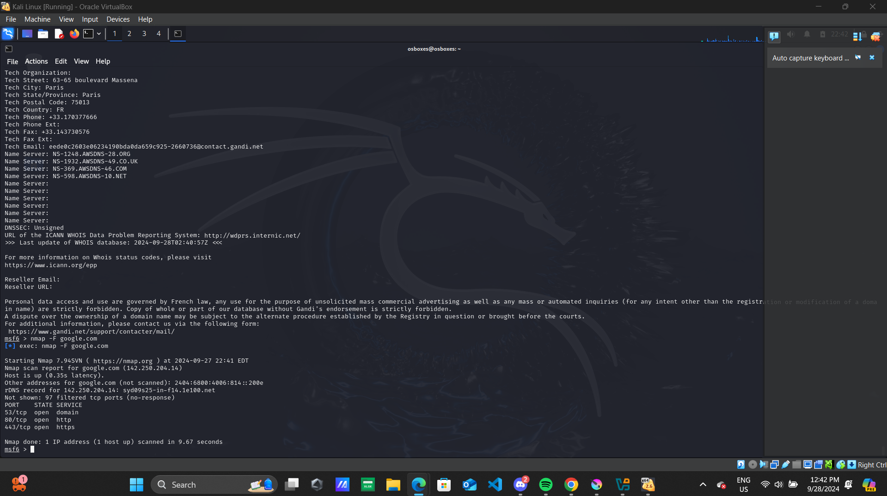
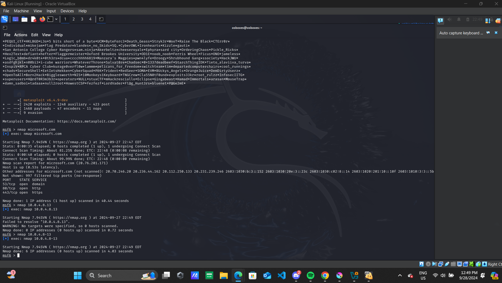
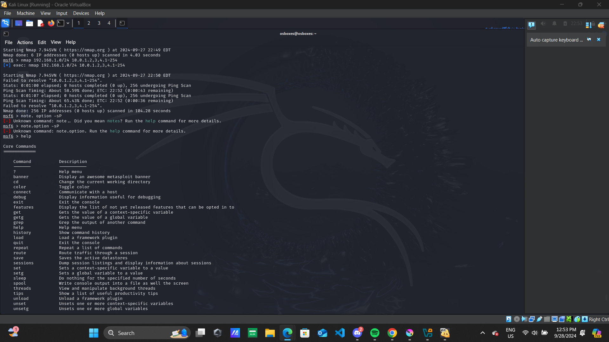
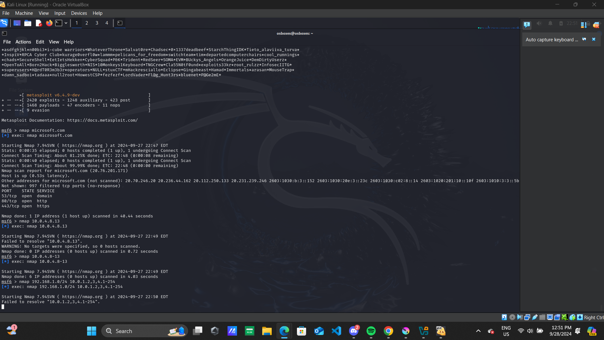
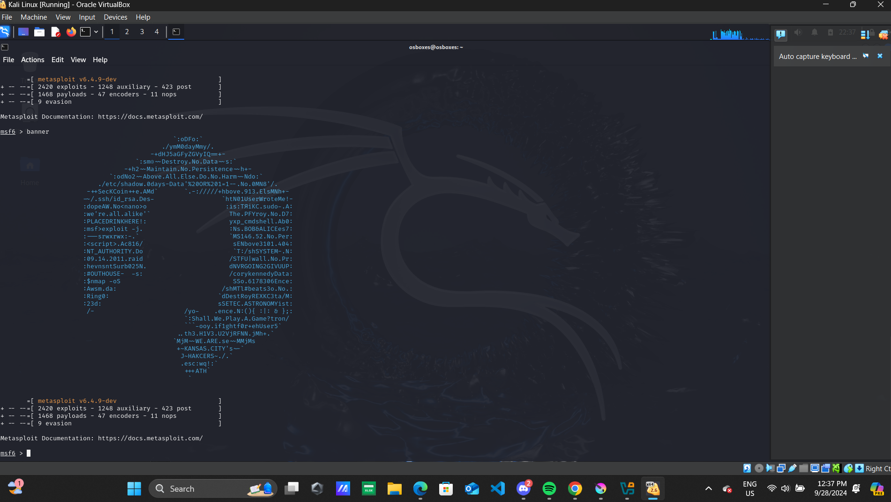

# 🔐 Network Scanning Lab (Nmap + Metasploit)

## 📖 Introduction

This project demonstrates basic network scanning techniques using Nmap and Metasploit in Kali Linux. The goal is to identify open ports, understand services, and practice real-world cybersecurity skills used in SOC environments.

---

## 📌 Objective

The objective of this lab is to understand and practice basic network reconnaissance techniques using Nmap and Metasploit in a Kali Linux environment.

---

## 🧰 Tools Used

- Nmap  
- Metasploit Framework  
- Kali Linux  
- VirtualBox  

---

## 🔍 Scan 1 — Public Target (Google)

### Findings:
- 80/tcp open → HTTP  
- 443/tcp open → HTTPS  

### Analysis:
This scan shows how public servers expose web services required for internet communication.

---

## 🔍 Scan 2 — Public Target (Microsoft)

### Findings:
- 80/tcp open → HTTP  
- 443/tcp open → HTTPS  

### Analysis:
Similar to Google, Microsoft exposes standard web services used in real-world environments.

---

## 🔍 Scan 3 — Localhost Analysis

### Findings:
- 5432/tcp open → PostgreSQL  

### Analysis:
This shows a local database service running, which could be a potential attack surface.

---

## ⚠️ Challenges and Troubleshooting

### Issues:
- Wrong Nmap syntax  
- DNS resolution errors  

### Fix:
- Reviewed command usage  
- Corrected syntax  

---

## 🧰 Metasploit Overview

### Observation:
Metasploit provides a structured framework for exploitation and security testing.

---

## 🧠 Skills Demonstrated

- Network scanning  
- Port identification  
- Basic troubleshooting  
- Use of cybersecurity tools  
- Analytical thinking  

---
## 📂 Project Structure

network-scanning-lab/
│
├── README.md
└── images/
├── google.png
├── microsoft.png
├── localhost.png
├── error.png
└── metasploit.png

---

## 🚀 Conclusion

This lab demonstrates foundational cybersecurity skills required for entry-level SOC roles.
